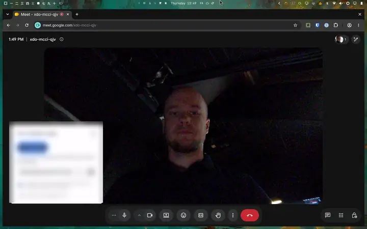

# Ring Light

Use a bright screen border to light your face during video calls.
This plugin runs inside the Omarchy Quickshell desktop.

- The border covers all four edges on each connected display.
- The light is strongest at the outer edge and fades smoothly to transparent toward the center.
- The center stays transparent.
- With more than one screen, the light shows on every screen or on one selected screen.
- Mouse clicks and scroll events pass through the entire border.
- The border stays above fullscreen apps and the bar.
- The light starts off when the shell starts or the plugin reloads.

The default border width is 64 logical pixels, including the full gradient.
The default color temperature is 6500 K, which is daylight white.
The default light level is 100 percent.
The temperature slider tints the border from candlelight at 1000 K to cool daylight at 12000 K.
The light level scales that color.
Use the display brightness keys to adjust the screen backlight.

## Demo



The clip shows a video call before the light, the light on, and a width change from the settings card.
[Watch the full quality video](docs/ring-light.mp4).

## Install

Add the plugin from its repository:

```bash
omarchy plugin add https://github.com/bjarneo/omarchy-ring-light-plugin.git --enable
```

The add command clones the plugin, validates the manifest, and places the ring icon in the right bar section.
Update it later with `omarchy plugin update bjarneo.ring-light`.

### Install from a checkout

For development, run this command from the project directory:

```bash
bash install.sh
```

The script installs the plugin at `~/.config/omarchy/plugins/bjarneo.ring-light/` and adds its ring icon before the display widget.
The script saves config backups in `~/.config/omarchy/ring-light-backup.*/`.
Run the script again after changes to the source files.

## Controls

Click the ring icon in the bar to turn on the light.
Right-click the ring icon to open the settings card.
While the light is on, the same icon floats on top of the border so you can turn it off or open settings without a shortcut.
If the bar icon cannot be located, a toggle chip appears at the top of the lit screen.

The card holds a screen select, a width slider, and a temperature slider.
The screen select appears when the machine has more than one screen.
Choose "All screens" to light every screen, or pick one screen to light only that screen.
The width slider sets the border width of the selected screen.
The temperature slider sets the color of the light from 1000 K to 12000 K.
Scroll on the ring icon, including the floating copy, to change the width by one step.

To add the shortcut, put this line in `~/.config/hypr/bindings.lua`:

```lua
o.bind("SUPER + ALT + L", "Toggle ring light", "omarchy-shell ring-light toggle")
```

To apply the shortcut, run:

```bash
hyprctl reload
hyprctl configerrors
```

Press **Super+Alt+L** to turn the light on or off.

Use these terminal commands for explicit control:

```bash
omarchy-shell ring-light toggle
omarchy-shell ring-light enable
omarchy-shell ring-light disable
omarchy-shell ring-light status
```

## Adjust the border

Drag the width slider to set the border from 16 to 800 logical pixels.
The slider shows the current width in pixels.
The border follows the slider while you drag, and the width is saved when you release it.

Drag the temperature slider to set the color from 1000 K to 12000 K in steps of 100 K.
The slider shows the current temperature in kelvin.
The border follows the slider while you drag, and the temperature is saved when you release it.

To send the light to one screen from the terminal, run:

```bash
omarchy bar set bjarneo.ring-light screen eDP-1
```

To light every screen, run:

```bash
omarchy bar set bjarneo.ring-light screen ""
```

To set a wider border from the terminal, run:

```bash
omarchy bar set bjarneo.ring-light borderWidth 96 --json
```

To reduce the light level, run:

```bash
omarchy bar set bjarneo.ring-light brightness 70 --json
```

To warm the light, run:

```bash
omarchy bar set bjarneo.ring-light temperature 3200 --json
```

These settings persist in `~/.config/omarchy/shell.json`.
The light level accepts values from 10 to 100 percent.
The color temperature accepts values from 1000 K to 12000 K.
The plugin limits the border width to half of the shortest screen dimension so the center stays open.

## Disable

To remove the widget and its overlay from the shell, run:

```bash
omarchy plugin disable bjarneo.ring-light
```

Remove the shortcut line from `~/.config/hypr/bindings.lua` if you no longer need it.
